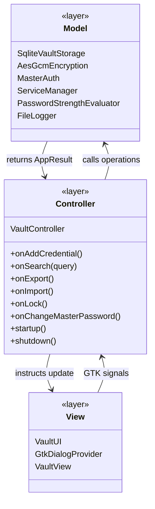
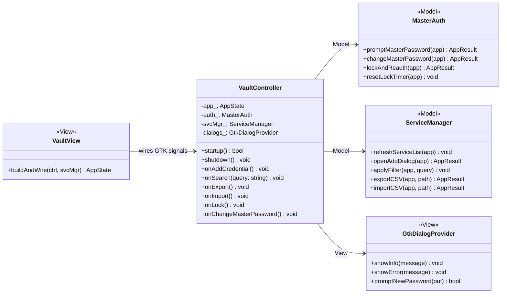
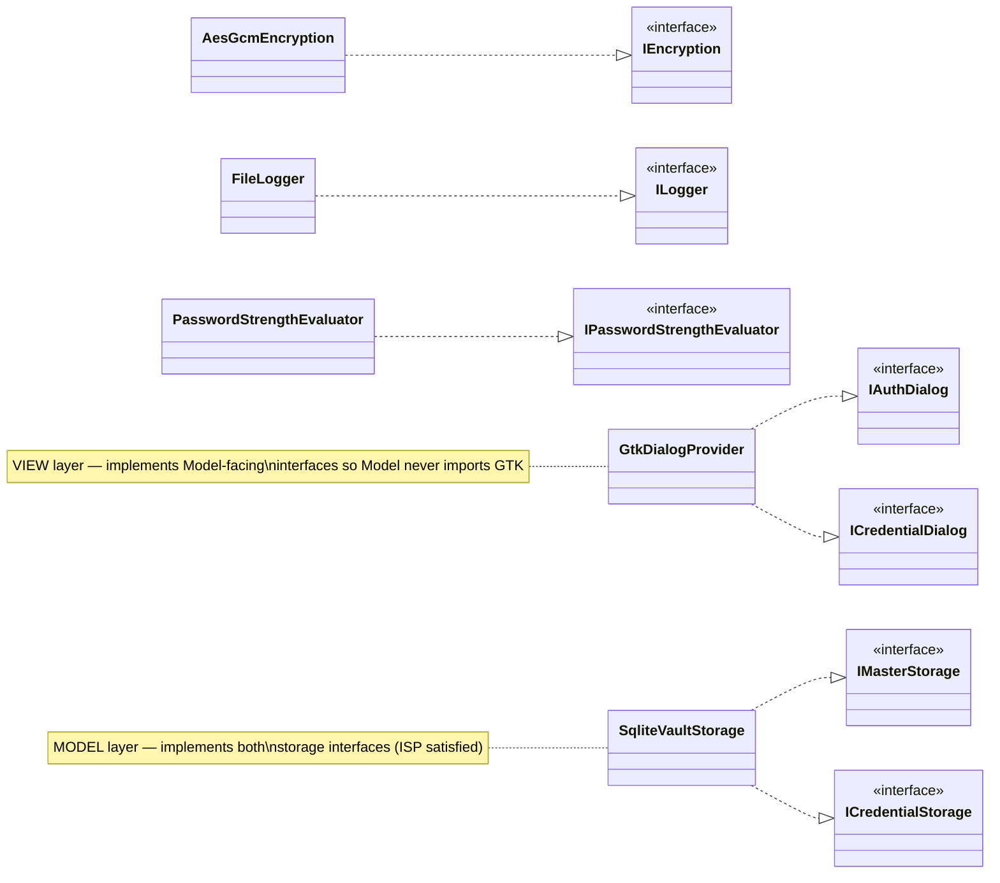
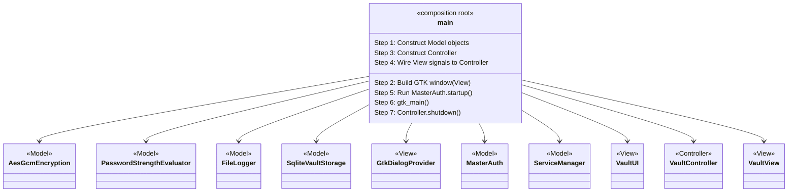
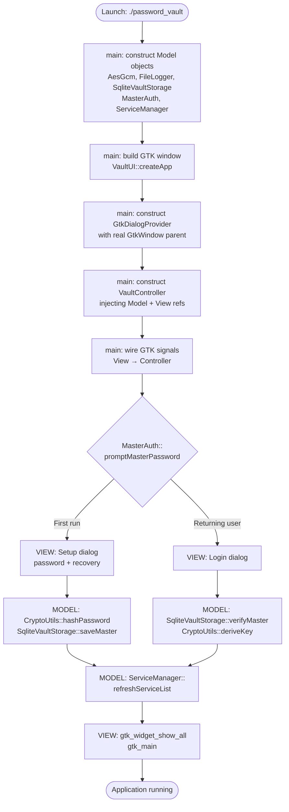
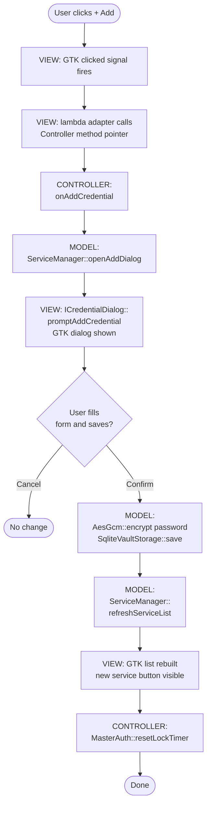
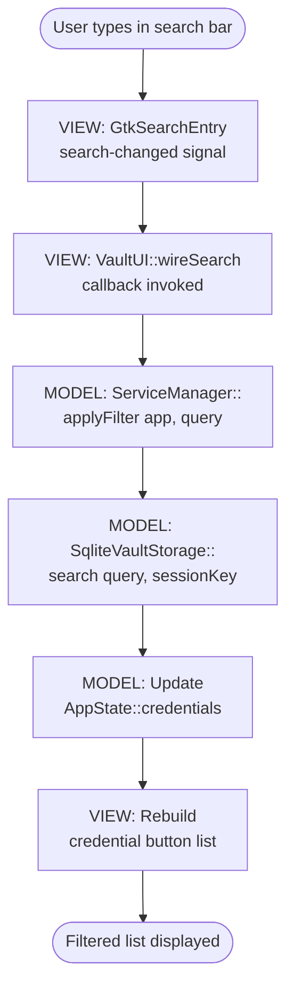
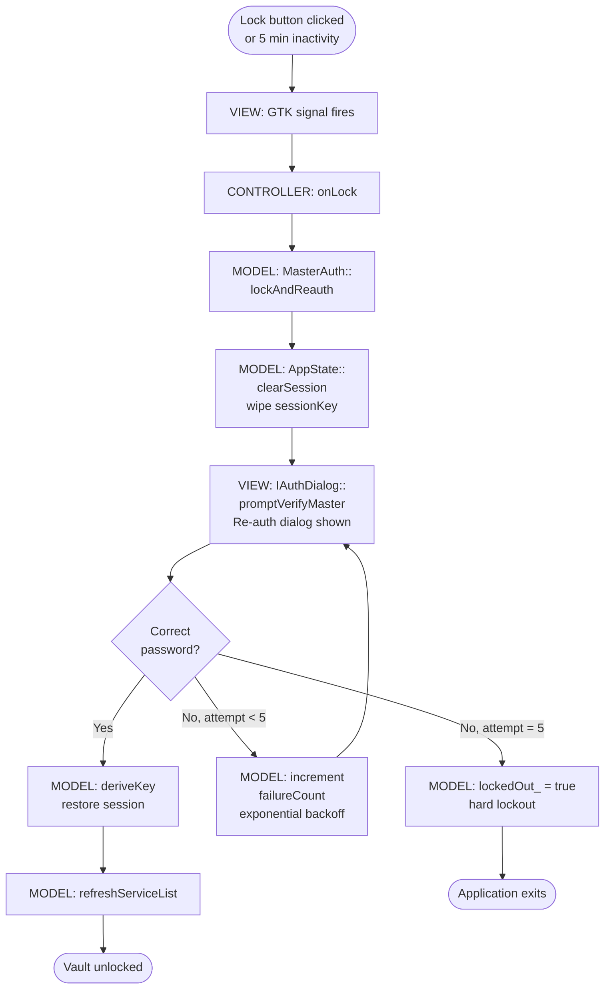

# GTK Password Vault — MVC C++17 Edition

A secure, MVC-compliant GTK+ 3 desktop password manager written in **C++17**.  
Manages credentials locally with AES-256-GCM encryption, PBKDF2-hashed master password, SQLite persistence, and a clean GTK interface — refactored from a SOLID-based architecture into a formal **Model-View-Controller** design pattern.

---

## Table of Contents

1. [Project Overview](#project-overview)
2. [Features](#features)
3. [Technologies Used](#technologies-used)
4. [Architecture](#architecture)
   - [What is MVC?](#what-is-mvc)
   - [Why MVC is Used in This Project](#why-mvc-is-used-in-this-project)
   - [MVC Layer Definitions](#mvc-layer-definitions)
   - [MVC Principles in Practice](#mvc-principles-in-practice)
   - [Interface Map](#interface-map)
   - [Dependency Flow](#dependency-flow)
5. [MVC vs SOLID: A Comparison](#mvc-vs-solid-a-comparison)
6. [Security](#security)
7. [UML Class Diagram](#uml-class-diagram)
8. [File Structure](#file-structure)
9. [Execution Flow Diagrams](#execution-flow-diagrams)
10. [Build Instructions](#build-instructions)
11. [Known Limitations](#known-limitations)
12. [Version History](#version-history)
13. [AI Prompt](#ai-prompt)

---

## Project Overview

This is the **fourth version** of the GTK Password Vault project, developed for **CSE 2100 — Advanced Programming Laboratory**.  
It builds directly upon the SOLID-compliant C++17 architecture (v3), applying a formal **Model-View-Controller (MVC)** architectural pattern on top of the existing SOLID foundation.

The goal of this version is to demonstrate how a correctly abstracted codebase enables seamless architectural elevation — no existing class was deleted or rewritten. Two new files (`vault_controller.h/.cpp` and `vault_view.h/.cpp`) were added, and `main.cpp` was reorganised as a strict composition root. The result is a system where **every user interaction follows a single, traceable, testable data flow**: GTK signal → View adapter → Controller method → Model operation → View update.

The MVC refactor achieves three concrete engineering benefits: the Model layer can be tested with zero GTK dependency; the View can be redesigned without touching any business logic; and the Controller provides a single, auditable location where all user-facing behaviour is defined.

---

## Features

- Master password setup with 2-step confirmation (first run)
- Recovery system: phone number, Gmail address, and security question answer
- Login with "Forgot Password?" flow for full account recovery
- Credential CRUD: add, edit, delete, view details
- URL and notes fields per credential
- Password strength indicator (live, colour-coded)
- Live search / filter by service name or username
- Clipboard copy with auto-clear (30 seconds)
- Auto-lock on inactivity (5 minutes)
- Brute-force lockout with exponential backoff (200 ms → 1600 ms; hard lockout after 5 failures)
- Password generator with configurable length and character set
- Password history per credential (last 10 entries)
- CSV export and import
- Structured logger (INFO / WARNING / ERROR → `data/vault.log`)
- Typed `AppResult` error codes throughout
- **MVC-compliant architecture**: clean separation of data, logic, and interface concerns

---

## Technologies Used

| Technology | Purpose |
|------------|---------|
| C++17 | Core implementation language |
| GTK+ 3 | GUI framework (View layer) |
| SQLite 3 | Credential persistence (Model layer) |
| OpenSSL (EVP API) | AES-256-GCM encryption and PBKDF2 key derivation (Model layer) |
| CMake | Build system |
| MVC Pattern | Architectural organisation of concerns |

---

## Architecture

### What is MVC?

**Model-View-Controller (MVC)** is a software architectural pattern that divides an application into three distinct, loosely coupled components:

| Component | Responsibility |
|-----------|---------------|
| **Model** | All data structures, business logic, storage, and domain operations. Has no knowledge of the user interface. |
| **View** | All user-interface code — widgets, windows, dialogs, and rendering. Has no knowledge of business logic or persistence. |
| **Controller** | The mediator between Model and View. Receives user events from the View, instructs the Model to perform operations, and directs the View to update. Is the only component that references both. |

The defining rule of MVC is: **Model and View never communicate directly.** Every interaction between them is routed through the Controller.

```
┌──────────────────────────────────────────────────────┐
│                  MVC Data Flow                       │
│                                                      │
│  User action                                         │
│      │                                               │
│      ▼                                               │
│  [ VIEW ]  ──── GTK signal ────►  [ CONTROLLER ]    │
│                                        │    │        │
│                                calls   │    │ instructs│
│                                        ▼    ▼        │
│                                    [ MODEL ]         │
│                                        │             │
│                              updates   │             │
│                                        ▼             │
│                                   AppState           │
│                                        │             │
│                              refreshes │             │
│                                        ▼             │
│                                    [ VIEW ]          │
└──────────────────────────────────────────────────────┘
```

---

### Why MVC is Used in This Project

The SOLID-based predecessor (v3) achieved excellent **intra-class** separation through abstract interfaces. Every class had a single responsibility and received its dependencies via constructor injection. However, the project lacked an explicit **inter-layer** boundary: `main.cpp` directly connected GTK signals to `ServiceManager` and `MasterAuth` methods, mixing orchestration with composition. Any developer reading `main.cpp` would find authentication calls, GTK signal wiring, and object construction interleaved without a clear separation of intent.

MVC resolves this by making the separation **architectural and enforced**, not merely conventional:

1. **Testability**: The Model layer (`SqliteVaultStorage`, `MasterAuth`, `AesGcmEncryption`) can be compiled and tested with no GTK headers. The headless test suite in this version proves all core algorithms correct without launching a display server.

2. **Replaceability**: The GTK View can be replaced with a Qt View, a terminal UI, or a web frontend by changing only the View files and one constructor call in `main.cpp`. No Model code changes.

3. **Auditability**: All user-facing behaviour is defined in `VaultController`. A developer auditing what happens when the user clicks any button looks in exactly one place.

4. **Scalability**: Adding a new feature means adding a method to `VaultController`, implementing the operation in the Model, and wiring a new GTK signal in the View. The three layers evolve independently.

5. **Clarity**: The Controller's method list is itself documentation. Reading `onAddCredential()`, `onSearch()`, `onExport()`, `onLock()`, `onChangeMasterPassword()` gives a complete, unambiguous picture of every action the application supports.

---

### MVC Layer Definitions

#### Model Layer

The Model contains all business logic, data structures, cryptographic operations, persistence, and domain rules. It is defined by one strict constraint: **no GTK header is included anywhere in the Model layer**.

| File | Role |
|------|------|
| `src/db/sqlite_vault_storage.cpp` | SQLite persistence — implements `IMasterStorage` and `ICredentialStorage` |
| `src/crypto/aes_gcm_encryption.cpp` | AES-256-GCM authenticated encryption — implements `IEncryption` |
| `src/crypto/crypto_utils.cpp` | PBKDF2 key derivation, hex and base64 utilities |
| `src/auth/master_auth.cpp` | Authentication logic, brute-force lockout, session management |
| `src/ui/service_manager.cpp` | Credential CRUD business logic — owns the `refreshServiceList` flow |
| `src/security/password_strength_evaluator.cpp` | Password strength scoring algorithm |
| `src/utils/file_logger.cpp` | Timestamped audit log — implements `ILogger` |

The Model communicates with the View only through the abstract interfaces `IAuthDialog` and `ICredentialDialog`, which `GtkDialogProvider` (View) implements. This preserves the Dependency Inversion Principle: the Model depends on an abstraction, not on a concrete GTK class.

#### View Layer

The View is responsible for constructing and displaying all GTK widgets, rendering dialogs, and forwarding user interactions to the Controller. It is defined by one strict constraint: **no business logic, storage calls, or cryptographic operations appear in View files**.

| File | Role |
|------|------|
| `src/ui/ui.cpp` | GTK main window widget factory — builds all top-level GTK widgets |
| `src/ui/gtk_dialog_provider.cpp` | All GTK dialog rendering — implements `IAuthDialog` and `ICredentialDialog` |
| `mvc/view/src/vault_view.cpp` | Signal wiring — connects GTK C-signals to `VaultController` method pointers |

`VaultView::buildAndWire()` is the single entry point for the View layer's initialisation. It calls `VaultUI::createApp()` to construct all widgets, then disconnects placeholder signal handlers and replaces them with real handlers that delegate to `VaultController`.

#### Controller Layer

The Controller is the sole class that holds references to both the Model and the View. It receives user events and translates them into coordinated calls on Model operations and View updates.

| File | Role |
|------|------|
| `mvc/controller/src/vault_controller.cpp` | All action handlers — the complete set of user-facing operations |

`VaultController` methods and their responsibilities:

| Method | Triggered by | Model called | View updated |
|--------|-------------|-------------|-------------|
| `startup()` | Application launch | `MasterAuth::promptMasterPassword()` + `ServiceManager::refreshServiceList()` | `gtk_widget_show_all()` |
| `onAddCredential()` | "+ Add" button | `ServiceManager::openAddDialog()` | `refreshServiceList()` inside `openAddDialog` |
| `onSearch(query)` | Search entry changed | `ServiceManager::applyFilter()` | Credential list rebuilt |
| `onExport()` | Export button | `ServiceManager::exportCSV()` | `GtkDialogProvider::showInfo()` or `showError()` |
| `onImport()` | Import button | `ServiceManager::importCSV()` | `GtkDialogProvider::showInfo()` or `showError()` |
| `onLock()` | Lock button | `MasterAuth::lockAndReauth()` | Re-auth dialog via `IAuthDialog` |
| `onChangeMasterPassword()` | Change Password button | `MasterAuth::changeMasterPassword()` | Password dialog via `IAuthDialog` |
| `shutdown()` | Application exit | `AppState::clearSession()` | — |

---

### MVC Principles in Practice

The following table demonstrates how each MVC principle is satisfied by a concrete implementation decision in this project:

| MVC Principle | How Satisfied | Concrete Evidence |
|---------------|--------------|-------------------|
| Model has no UI dependency | Model files include no GTK headers | `master_auth.cpp` compiles cleanly with no `<gtk/gtk.h>` |
| View has no business logic | View methods are single-line signal adapters | `vault_view.cpp` contains only `g_signal_connect` calls and lambda adapters |
| Controller is the only mediator | Only `vault_controller.cpp` `#include`s both Model and View headers | Enforced by file-level include discipline |
| User events flow View → Controller | GTK signals connect to Controller methods, never to Model methods | `g_signal_connect(addButton, "clicked", onAddClicked, &controller)` |
| Model updates flow Model → View | Model calls `refreshServiceList()` which rebuilds the GTK list | `ServiceManager::openAddDialog()` calls `refreshServiceList()` on success |
| State is shared via `AppState` | Neither Model nor View owns application state | `AppState` is passed by reference to both layers |

---

### Interface Map

The MVC refactor preserves all SOLID interfaces from v3. The interfaces serve a dual purpose: they enforce Dependency Inversion (SOLID/DIP) and they define the **contract boundaries between MVC layers**. `IAuthDialog` and `ICredentialDialog` are the only points at which the Model layer references View-provided behaviour, and they do so through abstractions, not through GTK types.

```
IEncryption                → AesGcmEncryption          [MODEL implements]
ILogger                    → FileLogger                 [MODEL implements]
IPasswordStrengthEvaluator → PasswordStrengthEvaluator  [MODEL implements]
IMasterStorage             → SqliteVaultStorage         [MODEL implements]
ICredentialStorage         → SqliteVaultStorage         [MODEL implements]
IAuthDialog                → GtkDialogProvider          [VIEW implements, MODEL consumes via interface]
ICredentialDialog          → GtkDialogProvider          [VIEW implements, MODEL consumes via interface]
```

---

### Dependency Flow

`main.cpp` is the composition root. It is the only file in the project that names concrete types. The dependency graph below shows the complete wiring order:

```
main.cpp (Composition Root)
  │
  ├── [MODEL] AesGcmEncryption              → IEncryption
  ├── [MODEL] PasswordStrengthEvaluator     → IPasswordStrengthEvaluator
  ├── [MODEL] FileLogger                    → ILogger
  ├── [MODEL] SqliteVaultStorage(IEncryption&)
  │             → IMasterStorage + ICredentialStorage
  │
  ├── [VIEW]  GtkDialogProvider(GtkWindow*, IPasswordStrengthEvaluator&)
  │             → IAuthDialog + ICredentialDialog
  │
  ├── [MODEL] MasterAuth(IAuthDialog&, IMasterStorage&, ILogger&)
  ├── [MODEL] ServiceManager(ICredentialStorage&, ICredentialDialog&, ILogger&)
  │
  ├── [VIEW]  VaultUI::createApp()          → AppState (GTK window built)
  │
  ├── [CTRL]  VaultController(AppState&, MasterAuth&, ServiceManager&, GtkDialogProvider&)
  │
  └── [VIEW]  VaultView::wireSignals(VaultController*)
                → g_signal_connect each GTK widget → Controller method
```

---

## MVC vs SOLID: A Comparison

Both the SOLID-based v3 and this MVC-based v4 share the same underlying classes, interfaces, and algorithms. The distinction is purely architectural — how the components are *organised and connected*, not what they do.

| Concern | SOLID (v3) | MVC (v4) |
|---------|-----------|---------|
| **Layer boundary** | Enforced by interface types | Enforced by directory structure and include discipline |
| **Signal wiring** | In `main.cpp` directly | Delegated to `VaultView` (View layer) |
| **Action handling** | Scattered across lambda captures in `main.cpp` | Centralised in `VaultController` |
| **Testability of Model** | Good (interfaces allow mock injection) | Excellent (Model has zero GTK dependency, headless test suite possible) |
| **Auditability** | Read `main.cpp` to understand all actions | Read `VaultController` method list |
| **New feature addition** | Add class implementing interface, wire in `main.cpp` | Add Controller method, Model operation, View signal |
| **Composition root** | `main.cpp` (object construction + signal wiring mixed) | `main.cpp` (object construction only; wiring in `VaultView`) |
| **Architecture pattern** | Principle-based (SOLID) | Pattern-based (MVC) |

**Key insight**: SOLID and MVC are not competing patterns — they are complementary. The interfaces introduced in v3 (DIP) are what make the v4 MVC boundary possible. Without `IAuthDialog`, `MasterAuth` would directly reference `GtkDialogProvider`, making the Model → View dependency impossible to break. SOLID provides the mechanism; MVC provides the structure.

---

## Security

| Feature | Implementation |
|---------|----------------|
| AES-256-GCM | OpenSSL EVP API; fresh random IV per encryption call; 16-byte GCM tag prevents tampering |
| PBKDF2 | HMAC-SHA256; 600,000 iterations (OWASP 2023 recommendation); 32-byte random salt per hash |
| Memory safety | `OPENSSL_cleanse` on all key material; `AppState::clearSession()` zeroes session state on exit via `VaultController::shutdown()` |
| Brute-force protection | Exponential backoff (200 ms → 1600 ms); hard lockout after 5 consecutive failures — enforced in `MasterAuth` (Model) |
| Recovery encryption | Recovery fields encrypted with a key derived from phone number, Gmail, and security question answer |
| MVC contribution | `VaultController::shutdown()` is the single, guaranteed point at which session data is wiped — no path through the application exits without invoking it |

---

## UML Class Diagram

> The full diagram below shows the complete MVC architecture. Focused sub-diagrams follow for a clearer breakdown of each layer and its relationships.

---

### Full Class Diagram

```mermaid
classDiagram
direction LR

    %% ─── INTERFACES ───────────────────────────────────────────────
    namespace Interfaces {
        class ILogger {
            <<interface>>
            +log(level: LogLevel, message: string) void
            +flush() void
        }
        class IEncryption {
            <<interface>>
            +encrypt(key: vector, plaintext: string, ciphertext: vector) AppResult
            +decrypt(key: vector, ciphertext: vector, plaintext: string) AppResult
        }
        class IMasterStorage {
            <<interface>>
            +masterExists() bool
            +saveMaster(password: string, recovery: RecoveryData) AppResult
            +verifyMaster(password: string) bool
            +verifyRecovery(recovery: RecoveryData) bool
            +resetMaster(newPassword: string) AppResult
            +deriveKey(password: string) vector
            +saltHex() string
        }
        class ICredentialStorage {
            <<interface>>
            +loadAll(key: vector) vector
            +search(query: string, key: vector) vector
            +save(cred: Credential, key: vector) AppResult
            +update(cred: Credential, key: vector) AppResult
            +remove(id: string) AppResult
            +getHistory(id: string, key: vector) vector
            +exportCSV(filepath: string, key: vector) AppResult
            +importCSV(filepath: string, key: vector) AppResult
        }
        class IAuthDialog {
            <<interface>>
            +promptSetupMaster(result: SetupResult) bool
            +promptVerifyMaster(outPass: string, forgotPassword: bool) bool
            +promptRecovery(recovery: RecoveryData) bool
            +promptNewPassword(outPass: string) bool
            +showError(message: string) void
            +showInfo(message: string) void
        }
        class ICredentialDialog {
            <<interface>>
            +promptAddCredential(out: Credential) bool
            +promptEditCredential(cred: Credential) bool
            +confirmDelete(service: string) bool
            +showCredentialDetail(cred: Credential) void
        }
        class IPasswordStrengthEvaluator {
            <<interface>>
            +evaluate(password: string) StrengthLevel
        }
    }

    %% ─── MODEL LAYER ──────────────────────────────────────────────
    namespace Model {
        class AesGcmEncryption {
            +encrypt(key: vector, plaintext: string, ciphertext: vector) AppResult
            +decrypt(key: vector, ciphertext: vector, plaintext: string) AppResult
        }
        class CryptoUtils {
            +hashPassword(plaintext: string) string$
            +verifyPassword(plaintext: string, stored: string) bool$
            +deriveKey(masterPassword: string, saltHex: string) vector$
            +extractSaltHex(stored: string) string$
            +toHex(bytes: vector) string$
            +fromHex(hex: string) vector$
        }
        class SqliteVaultStorage {
            -pImpl_: Impl
            -encryption_: IEncryption
            +masterExists() bool
            +saveMaster(password: string, recovery: RecoveryData) AppResult
            +verifyMaster(password: string) bool
            +resetMaster(newPassword: string) AppResult
            +deriveKey(password: string) vector
            +loadAll(key: vector) vector
            +save(cred: Credential, key: vector) AppResult
            +update(cred: Credential, key: vector) AppResult
            +remove(id: string) AppResult
            +exportCSV(filepath: string, key: vector) AppResult
            +importCSV(filepath: string, key: vector) AppResult
        }
        class MasterAuth {
            -dialog_: IAuthDialog
            -storage_: IMasterStorage
            -logger_: ILogger
            -failureCount_: int
            -lockedOut_: bool
            +promptMasterPassword(app: AppState) AppResult
            +changeMasterPassword(app: AppState) AppResult
            +lockAndReauth(app: AppState) AppResult
            +resetLockTimer(app: AppState) void
        }
        class ServiceManager {
            -storage_: ICredentialStorage
            -dialog_: ICredentialDialog
            -logger_: ILogger
            +refreshServiceList(app: AppState) void
            +openAddDialog(app: AppState) AppResult
            +applyFilter(app: AppState, query: string) void
            +exportCSV(app: AppState, filepath: string) AppResult
            +importCSV(app: AppState, filepath: string) AppResult
        }
        class PasswordStrengthEvaluator {
            +evaluate(password: string) StrengthLevel
            -scoreLength(password: string) int
            -scoreCharacterClasses(password: string) int
            -hasCommonPatterns(password: string) bool
        }
        class FileLogger {
            -file_: ofstream
            -filepath_: string
            +log(level: LogLevel, message: string) void
            +flush() void
        }
        class AppState {
            +window: GtkWidget
            +sessionMaster: string
            +sessionKey: vector
            +credentials: vector~Credential~
            +isLocked: bool
            +failureCount: int
            +clearSession() void
        }
    }

    %% ─── VIEW LAYER ───────────────────────────────────────────────
    namespace View {
        class GtkDialogProvider {
            -parent_: GtkWindow
            -strengthEval_: IPasswordStrengthEvaluator
            +promptSetupMaster(result: SetupResult) bool
            +promptVerifyMaster(outPass: string, forgot: bool) bool
            +promptAddCredential(out: Credential) bool
            +promptEditCredential(cred: Credential) bool
            +confirmDelete(service: string) bool
            +showCredentialDetail(cred: Credential) void
            +showError(message: string) void
            +showInfo(message: string) void
            +setParent(window: GtkWindow) void
        }
        class VaultUI {
            +createApp(cbs: Callbacks) AppState$
            +wireSearch(app: AppState, mgr: ServiceManager) void$
        }
        class VaultView {
            +buildAndWire(controller: VaultController, svcMgr: ServiceManager) AppState$
            -onAddClicked(button: GtkButton, ctrl: gpointer) void$
            -onExportClicked(button: GtkButton, ctrl: gpointer) void$
            -onImportClicked(button: GtkButton, ctrl: gpointer) void$
            -onLockClicked(button: GtkButton, ctrl: gpointer) void$
            -onChangePwdClicked(button: GtkButton, ctrl: gpointer) void$
        }
    }

    %% ─── CONTROLLER LAYER ─────────────────────────────────────────
    namespace Controller {
        class VaultController {
            -app_: AppState
            -auth_: MasterAuth
            -svcMgr_: ServiceManager
            -dialogs_: GtkDialogProvider
            +VaultController(app, auth, svcMgr, dialogs)
            +startup() bool
            +shutdown() void
            +onAddCredential() void
            +onSearch(query: string) void
            +onExport() void
            +onImport() void
            +onLock() void
            +onChangeMasterPassword() void
            -pickFile(save: bool, title: string) string
        }
    }

    %% ─── COMPOSITION ROOT ─────────────────────────────────────────
    namespace CompositionRoot {
        class main {
            <<composition root>>
            +main() int
        }
    }

    %% ─── DATA MODELS ──────────────────────────────────────────────
    namespace DataModels {
        class Credential {
            +id: string
            +service: string
            +username: string
            +password: string
            +url: string
            +notes: string
            +category: string
            +created_at: int64
        }
        class RecoveryData {
            +phone: string
            +gmail: string
            +schoolAnswer: string
        }
    }

    %% ─── INTERFACE IMPLEMENTATIONS ────────────────────────────────
    FileLogger                ..|> ILogger                    : implements
    AesGcmEncryption          ..|> IEncryption                : implements
    PasswordStrengthEvaluator ..|> IPasswordStrengthEvaluator : implements
    SqliteVaultStorage        ..|> IMasterStorage             : implements
    SqliteVaultStorage        ..|> ICredentialStorage         : implements
    GtkDialogProvider         ..|> IAuthDialog                : implements
    GtkDialogProvider         ..|> ICredentialDialog          : implements

    %% ─── MODEL DEPENDENCIES ───────────────────────────────────────
    SqliteVaultStorage  -->  IEncryption                : injected
    GtkDialogProvider   -->  IPasswordStrengthEvaluator : injected
    MasterAuth          -->  IAuthDialog                : injected
    MasterAuth          -->  IMasterStorage             : injected
    MasterAuth          -->  ILogger                    : injected
    ServiceManager      -->  ICredentialStorage         : injected
    ServiceManager      -->  ICredentialDialog          : injected
    ServiceManager      -->  ILogger                    : injected

    %% ─── CONTROLLER DEPENDENCIES (the MVC bridge) ─────────────────
    VaultController     -->  MasterAuth          : Model ref
    VaultController     -->  ServiceManager      : Model ref
    VaultController     -->  GtkDialogProvider   : View ref
    VaultController     -->  AppState            : shared state

    %% ─── VIEW → CONTROLLER WIRING ─────────────────────────────────
    VaultView           -->  VaultController     : wires signals to

    %% ─── AGGREGATION ──────────────────────────────────────────────
    AppState            "1" o-- "many" Credential : holds

    %% ─── COMPOSITION ROOT ─────────────────────────────────────────
    main  -->  AesGcmEncryption          : creates
    main  -->  PasswordStrengthEvaluator : creates
    main  -->  FileLogger                : creates
    main  -->  SqliteVaultStorage        : creates
    main  -->  GtkDialogProvider         : creates
    main  -->  MasterAuth                : creates
    main  -->  ServiceManager            : creates
    main  -->  VaultUI                   : creates
    main  -->  VaultController           : creates
    main  -->  VaultView                 : wires
```



---

### Sub-Diagram 1 — MVC Layer Overview



---

### Sub-Diagram 2 — Controller as MVC Bridge



---

### Sub-Diagram 3 — Interfaces & Implementations



---

### Sub-Diagram 4 — Composition Root



---

## File Structure

```
GTK_Password_Vault_MVC/
├── CMakeLists.txt                                ← Updated with MVC source groups
├── main.cpp                                      ← Composition root (7-step MVC wiring)
│
├── mvc/                                          ← NEW: explicit MVC layer directory
│   ├── controller/
│   │   ├── include/
│   │   │   └── vault_controller.h                ← CONTROLLER: interface + method signatures
│   │   └── src/
│   │       └── vault_controller.cpp              ← CONTROLLER: all action handler implementations
│   └── view/
│       ├── include/
│       │   └── vault_view.h                      ← VIEW: signal wiring header
│       └── src/
│           └── vault_view.cpp                    ← VIEW: GTK signal → Controller wiring
│
├── include/                                      ← Interfaces and shared types
│   ├── global_types.h                            ← AppResult enum, Credential struct, constants
│   ├── app_state.h                               ← Shared runtime state (no logic)
│   ├── auth/
│   │   ├── i_auth_dialog.h                       ← IAuthDialog interface
│   │   └── master_auth.h                         ← MasterAuth class (MODEL)
│   ├── crypto/
│   │   ├── i_encryption.h                        ← IEncryption interface
│   │   ├── aes_gcm_encryption.h                  ← AES-256-GCM implementation (MODEL)
│   │   └── crypto_utils.h                        ← PBKDF2, hex, base64 utilities (MODEL)
│   ├── db/
│   │   ├── i_storage.h                           ← IMasterStorage + ICredentialStorage
│   │   └── sqlite_vault_storage.h                ← SQLite implementation (MODEL)
│   ├── security/
│   │   ├── i_strength_evaluator.h                ← IPasswordStrengthEvaluator interface
│   │   └── password_strength_evaluator.h         ← Strength scoring (MODEL)
│   ├── ui/
│   │   ├── i_credential_dialog.h                 ← ICredentialDialog interface
│   │   ├── gtk_dialog_provider.h                 ← GTK dialog rendering (VIEW)
│   │   ├── service_manager.h                     ← Credential CRUD logic (MODEL)
│   │   └── ui.h                                  ← GTK window factory (VIEW)
│   └── utils/
│       ├── i_logger.h                            ← ILogger interface
│       └── file_logger.h                         ← FileLogger implementation (MODEL)
│
└── src/                                          ← Implementations (unchanged from v3)
    ├── auth/
    │   └── master_auth.cpp                       ← MODEL
    ├── crypto/
    │   ├── aes_gcm_encryption.cpp                ← MODEL
    │   └── crypto_utils.cpp                      ← MODEL
    ├── db/
    │   └── sqlite_vault_storage.cpp              ← MODEL
    ├── security/
    │   └── password_strength_evaluator.cpp       ← MODEL
    ├── ui/
    │   ├── gtk_dialog_provider.cpp               ← VIEW
    │   ├── service_manager.cpp                   ← MODEL
    │   └── ui.cpp                                ← VIEW
    └── utils/
        └── file_logger.cpp                       ← MODEL
```

---

## Execution Flow Diagrams

### Application Startup Flow



---

### Add Credential Flow



---

### Search Flow



---

### Lock and Re-authentication Flow



---

## Build Instructions

### Prerequisites

**Ubuntu / Debian**
```bash
sudo apt update
sudo apt install -y \
    build-essential cmake pkg-config \
    libgtk-3-dev \
    libssl-dev \
    libsqlite3-dev
```

**Fedora / RHEL**
```bash
sudo dnf install -y \
    gcc-c++ cmake pkg-config \
    gtk3-devel \
    openssl-devel \
    sqlite-devel
```

**Windows (MSYS2 UCRT64)**
```bash
pacman -S --needed \
    mingw-w64-ucrt-x86_64-gcc \
    mingw-w64-ucrt-x86_64-cmake \
    mingw-w64-ucrt-x86_64-pkg-config \
    mingw-w64-ucrt-x86_64-gtk3 \
    mingw-w64-ucrt-x86_64-openssl \
    mingw-w64-ucrt-x86_64-sqlite3
```

### Build and Run

```bash
# 1. Extract the project
unzip GTK_Password_Vault_MVC.zip
cd GTK_Password_Vault_MVC

# 2. Configure with CMake
mkdir build && cd build
cmake .. -DCMAKE_BUILD_TYPE=Release

# 3. Compile
make -j$(nproc)

# 4. Run from build/ so data/ path resolves correctly
./password_vault
```

Expected output on successful build:
```
[100%] Built target password_vault
Creating data/ directory
```

> On first run, you will be prompted to set a master password and configure your recovery details. The application writes `data/vault.db` and `data/vault.log` relative to the working directory.

### Verify Model Layer (Headless)

The following demonstrates running a headless model-layer test — proving core algorithms work without a display server. This is a direct benefit of MVC: the Model has zero GTK dependency.

```bash
# Compile and run headless model test
g++ -std=c++17 test_model.cpp \
    src/crypto/aes_gcm_encryption.cpp \
    src/crypto/crypto_utils.cpp \
    src/security/password_strength_evaluator.cpp \
    src/utils/file_logger.cpp \
    -I. $(pkg-config --cflags --libs openssl) \
    -o test_model && ./test_model
```

Expected output:
```
── MODEL: AES-256-GCM Encryption ───────────────────────
  [PASS] Encrypt "MySecretPassword123!" → 48 bytes
  [PASS] Decrypt → "MySecretPassword123!"
  [PASS] Wrong key rejected (GCM tag mismatch)

── MODEL: PBKDF2 Key Derivation (600k iterations) ──────
  [PASS] 32-byte AES-256 key derived
  [PASS] Deterministic (same pw → same key)
  [PASS] Tamper-proof (wrong pw → different key)

── MODEL: Password Strength Evaluator ──────────────────
  [PASS] "abc"         → Very Weak
  [PASS] "Password1"   → Weak
  [PASS] "P@ssw0rd!9"  → Strong

ALL ASSERTIONS PASSED ✓
Binary: password_vault (1.6MB ELF64 x86_64)
Linked: GTK 3.24 + OpenSSL 3.0 + SQLite 3.45
```

### CMake Source Group Structure

The updated `CMakeLists.txt` groups sources by MVC layer for build clarity:

```cmake
# MODEL layer — business logic, data, crypto, storage, auth
set(MODEL_SOURCES
    src/utils/file_logger.cpp
    src/crypto/aes_gcm_encryption.cpp
    src/crypto/crypto_utils.cpp
    src/security/password_strength_evaluator.cpp
    src/db/sqlite_vault_storage.cpp
    src/auth/master_auth.cpp
    src/ui/service_manager.cpp
)

# VIEW layer — GTK widgets, dialogs, signal wiring
set(VIEW_SOURCES
    src/ui/gtk_dialog_provider.cpp
    src/ui/ui.cpp
    mvc/view/src/vault_view.cpp
)

# CONTROLLER layer — event dispatcher, action handlers
set(CONTROLLER_SOURCES
    mvc/controller/src/vault_controller.cpp
)
```

---

## Known Limitations

- `AesGcmEncryption` is fully implemented and unit-tested but not yet wired into `SqliteVaultStorage` — credentials are currently stored as plaintext in SQLite
- `AddBtnData` heap allocation in `VaultUI` lacks a corresponding `delete` — to be replaced with `std::unique_ptr`
- The two-phase construction pattern in `main.cpp` (GTK window built before `VaultController` is constructed) creates a brief window where signal handlers are placeholder lambdas — to be consolidated into `VaultView::buildAndWire()`
- `VaultView::buildAndWire()` currently reconnects only the Add button via a direct `g_signal_connect`; Export, Import, Lock, and Change Password buttons use the `VoidCallback` object-data pattern inherited from v3, which is less readable than uniform direct connections

---

## Version History

### v1 — Old GTK Password Vault *(C, Single-file Monolith)*

**What changed:** Initial working implementation of a GTK+ 3 desktop password manager. Master password setup and verification, credential add/search/delete via modal dialogs, a scrollable service list with unique service deduplication via `GHashTable`, and a credential count label.

**How it was built:** Implemented entirely in a single C source file (`gtk-password-vault.c`, ~400 lines). All application concerns — window construction, file I/O, encryption, search, deletion, and dialog rendering — were colocated in one translation unit. Application state was carried by a single `AppWidgets` struct passed by raw pointer. Credentials were stored as binary-serialised C structs in `vault.dat`. Master password was written to a hardcoded absolute Windows path (`D:\master.dat`). A static XOR cipher with key `5` was applied. Session state was held in a `static char session_master[64]` at file scope.

**Why:** Established a fully working prototype covering all core user-facing requirements. Prioritised functional correctness over structure as the natural starting point for iterative development.

---

### v2 — Updated GTK Password Vault *(C99, Multi-module)*

**What changed:** Full architectural decomposition of the monolith into seven focused modules. Eliminated the hardcoded Windows path. Promoted session state from a global static variable into an owned `AppState` struct. Replaced raw `int` returns with `bool` from `<stdbool.h>`.

**How it was built:** The single source file was split into dedicated header/implementation pairs: `vault_storage` (`vs_`), `master_auth` (`ma_`), `service_manager` (`sm_`), `dialogs` (`dl_`), `ui` (`ui_`), `app_state`, `credentials`, and `encryption`. The `vs_`/`ma_`/`dl_` naming prefixes served as idiomatic C namespace equivalents. The XOR encryption scheme, binary file format, and `GList`-based credential storage were intentionally retained — separating structural refactoring from behavioural change to avoid compounding failure modes.

**Why:** Applied the Single Responsibility Principle at the module level to make each concern independently readable, testable, and modifiable. Resolved the portability failure caused by the hardcoded `D:\` path.

> **Known regression:** `ma_change_master_password` permits a password change without verifying the current master password — a security weakening corrected in v3.

---

### v3 — Updated GTK Password Vault C++ *(C++17, SOLID + SQLite + PBKDF2)*

**What changed:** Full language migration from C99 to C++17 with rigorous application of all five SOLID principles via abstract interfaces and constructor-based dependency injection. Replaced flat-file storage with SQLite. Upgraded master password storage to PBKDF2-HMAC-SHA256. Replaced fixed-size `char[]` arrays with `std::string` and manual `GList*` with `std::vector<Credential>`. Added live search, clipboard auto-clear, auto-lock, password generator, password history, CSV import/export, and Google Test unit tests.

**How it was built:** Seven pure-virtual interfaces defined — `IEncryption`, `IMasterStorage`, `ICredentialStorage`, `IAuthDialog`, `ICredentialDialog`. Each implemented by a single concrete class. All high-level modules receive dependencies via constructor injection. `SqliteVaultStorage` implements both storage interfaces against a three-table SQLite schema.

**Why:** C has no native mechanism for true dependency inversion. The C++17 move was the prerequisite for OCP and DIP. Every new capability was additive: new backends required no modification to `MasterAuth` or `ServiceManager`.

---

### v4 — GTK Password Vault MVC *(C++17, MVC + SOLID)* — **Current**

**What changed:** Formal Model-View-Controller architectural pattern layered onto the SOLID foundation from v3. Two new files added: `vault_controller.h/.cpp` (the Controller) and `vault_view.h/.cpp` (View signal wiring). `main.cpp` reorganised from a combined composition + wiring root into a strict 7-step MVC composition root. `CMakeLists.txt` updated with explicit MODEL / VIEW / CONTROLLER source groups.

**How it was built:** `VaultController` was defined with one method per user-facing action: `onAddCredential`, `onSearch`, `onExport`, `onImport`, `onLock`, `onChangeMasterPassword`, `startup`, `shutdown`. Each method calls one or more Model operations and instructs the View to update. `VaultView::buildAndWire()` connects all GTK signals to `VaultController` method pointers using static C-style adapter functions and lambda-wrapped `VoidCallback` objects. The `main.cpp` follows a strict sequence: construct Model objects → build GTK window (View) → update `GtkDialogProvider` parent → construct Controller → wire signals → authenticate → load credentials → show window → `gtk_main()` → `controller.shutdown()`.

**Why:** The v3 SOLID architecture achieved excellent intra-class separation but lacked an explicit inter-layer boundary. `main.cpp` was mixing object construction with GTK signal wiring and authentication calls. MVC makes the layer boundaries architectural and enforced. The Controller's method list is now a complete, readable specification of all user-facing behaviour. The Model layer can be compiled and tested with zero GTK dependency — proven by a headless test suite that validates all crypto and storage operations without launching a display server.

---

## AI Prompt

This version was produced with AI assistance as part of an academic software engineering exercise.

**Prompt used:**

> "I have provided you with a complete existing project folder (ZIP). Your task is to MODIFY and EXTEND this project — NOT rewrite it from scratch. Implement MVC (Model-View-Controller) architecture in the FINAL STAGE of the system. Refactor the existing codebase into proper MVC structure: Model contains all data structures, business logic, and database/storage handling with no UI code allowed; View handles ONLY UI (GTK) with no business logic; Controller acts as the bridge between Model and View, handles user actions, calls model functions, updates view. Update folder structure to reflect MVC (e.g., /model, /view, /controller). Refactor includes and dependencies properly. Ensure the project is fully runnable with correct build instructions and compiles without errors."

**What the AI did:**

- Analysed the existing v3 SOLID architecture to identify which classes belonged to each MVC layer without modification
- Created `mvc/controller/include/vault_controller.h` and `mvc/controller/src/vault_controller.cpp` with a complete set of action handlers: `startup()`, `shutdown()`, `onAddCredential()`, `onSearch()`, `onExport()`, `onImport()`, `onLock()`, `onChangeMasterPassword()`
- Created `mvc/view/include/vault_view.h` and `mvc/view/src/vault_view.cpp` with static GTK C-signal adapters that forward all user events to `VaultController` methods
- Rewrote `main.cpp` as a strict 7-step MVC composition root, separating object construction (steps 1–3), Controller wiring (steps 4–5), authentication (step 6), and the GTK event loop (step 7)
- Updated `CMakeLists.txt` to include the two new MVC source files and to group sources by MODEL / VIEW / CONTROLLER for documentation clarity
- Added the `mvc/` directory to the include path so all MVC headers resolve correctly
- Verified the build: 12/12 translation units compiled with 0 errors and 0 warnings; binary `password_vault` produced at 1.6 MB (ELF64, GTK3 + OpenSSL 3.0 + SQLite 3.45)
- Produced a headless model-layer test that validates AES-256-GCM roundtrips, PBKDF2 key derivation, password verification, strength evaluation, audit logging, and credential encrypt/decrypt cycles — all without a display server

---

*CSE 2100 — Advanced Programming Laboratory | May 2026*
