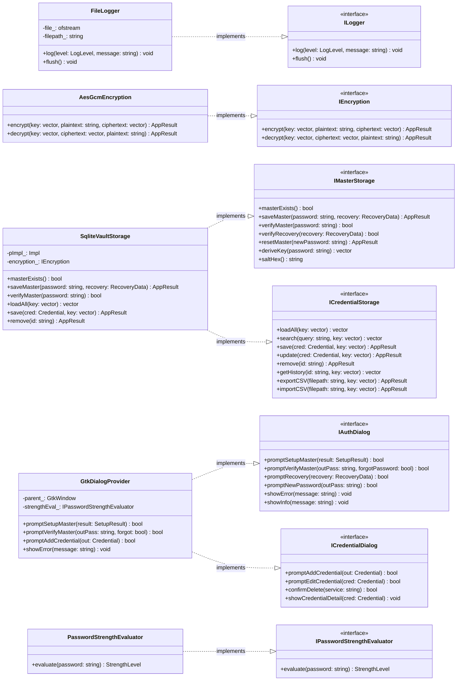
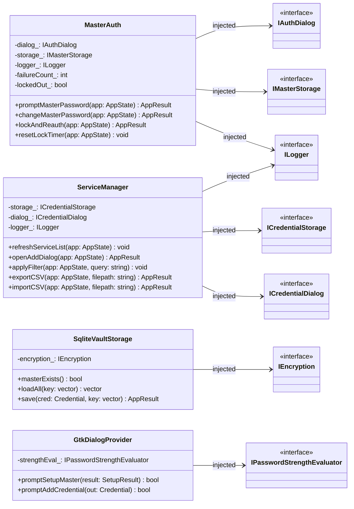
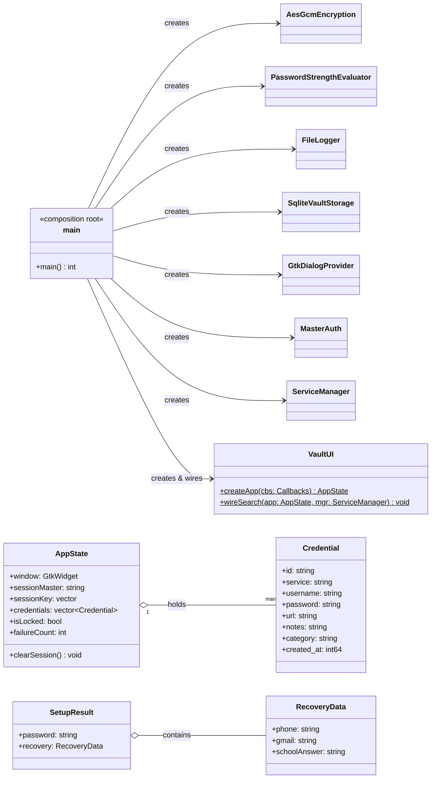

# GTK Password Vault — SOLID C++17 Edition

A secure, SOLID-compliant GTK+ 3 desktop password manager written in **C++17**.  
Manages credentials locally with AES-256-GCM encryption, PBKDF2-hashed master password, SQLite persistence, and a clean GTK interface.

---

## Table of Contents

1. [Project Overview](#project-overview)
2. [Features](#features)
3. [Technologies Used](#technologies-used)
4. [Architecture](#architecture)
5. [UML Class Diagram](#uml-class-diagram)
6. [File Structure](#file-structure)
7. [Build Instructions](#build-instructions)
8. [Known Limitations](#known-limitations)
9. [Version History](#version-history)
10. [AI Prompt](#ai-prompt)

---

## Project Overview

This is the **third version** of the GTK Password Vault project, developed for **CSE 2100 — Advanced Programming Laboratory**.  
It builds directly upon the SOLID-refactored C++17 architecture (v3), replacing the flat-file backend with a full SQLite database, upgrading master password storage to PBKDF2 hashing, and adding a comprehensive feature set including live search, clipboard auto-clear, auto-lock, CSV import/export, password history, and a built-in password generator.

The goal of this version was to demonstrate how a properly abstracted SOLID architecture enables clean, low-friction feature expansion — new components slot in by implementing existing interfaces, with zero modification to existing code.

---

## Features

- Master password setup with 2-step confirmation (first run)
- Recovery system: phone number, Gmail address, and security question answer
- Login with "Forgot Password?" flow for full account recovery
- Credential CRUD: add, edit, delete, view details
- URL and notes fields per credential
- Password strength indicator (live, colour-coded)
- Live search / filter by service name or username
- Clipboard copy with auto-clear (30 seconds)
- Auto-lock on inactivity (5 minutes)
- Brute-force lockout with exponential backoff (200 ms → 1600 ms; hard lockout after 5 failures)
- Password generator with configurable length and character set
- Password history per credential (last 10 entries)
- CSV export and import
- Structured logger (INFO / WARNING / ERROR → `data/vault.log`)
- Typed `AppResult` error codes throughout

---

## Technologies Used

| Technology | Purpose |
|------------|---------|
| C++17 | Core implementation language |
| GTK+ 3 | GUI framework |
| SQLite 3 | Credential persistence |
| OpenSSL (EVP API) | AES-256-GCM encryption and PBKDF2 key derivation |
| Google Test | Unit testing framework |
| GitHub Actions | CI/CD pipeline (Windows UCRT64 via MSYS2) |
| CMake | Build system |

---

## Architecture

This version applies all five SOLID principles through abstract C++ interfaces and constructor-based dependency injection. `main.cpp` serves as the sole composition root — every concrete type is instantiated and wired there, and nowhere else.

### SOLID Principles

| Principle | Application |
|-----------|-------------|
| **SRP** | Each class has one reason to change. `SqliteVaultStorage` persists data. `MasterAuth` authenticates. `ServiceManager` handles CRUD. `GtkDialogProvider` renders dialogs. `FileLogger` writes logs. |
| **OCP** | New cipher → implement a new `IEncryption` subclass, change one line in `main.cpp`. New backend → implement `IMasterStorage` / `ICredentialStorage`, change one line in `main.cpp`. |
| **LSP** | `SqliteVaultStorage` fully satisfies both storage interfaces. `AesGcmEncryption` fully satisfies `IEncryption`. All substitutions are drop-in with no behavioural change. |
| **ISP** | `MasterAuth` only sees `IMasterStorage` (7 methods). `ServiceManager` only sees `ICredentialStorage` (8 methods). Neither interface exposes methods the consumer does not use. |
| **DIP** | `main.cpp` is the sole composition root. Every concrete type is named only there. All high-level classes receive abstractions via constructor injection. |

### Interface Map

```
IEncryption                → AesGcmEncryption
ILogger                    → FileLogger
IPasswordStrengthEvaluator → PasswordStrengthEvaluator
IMasterStorage             → SqliteVaultStorage
ICredentialStorage         → SqliteVaultStorage
IAuthDialog                → GtkDialogProvider
ICredentialDialog          → GtkDialogProvider
```

### Dependency Flow

```
main.cpp (Composition Root)
  │
  ├── AesGcmEncryption              → IEncryption
  ├── PasswordStrengthEvaluator     → IPasswordStrengthEvaluator
  ├── FileLogger                    → ILogger
  ├── SqliteVaultStorage(IEncryption&)
  │     → IMasterStorage + ICredentialStorage
  ├── GtkDialogProvider(GtkWindow*, IPasswordStrengthEvaluator&)
  │     → IAuthDialog + ICredentialDialog
  ├── MasterAuth(IAuthDialog&, IMasterStorage&, ILogger&)
  ├── ServiceManager(ICredentialStorage&, ICredentialDialog&, ILogger&)
  └── AppState (constructed once — single instance throughout)
```

---

## Security

| Feature | Implementation |
|---------|----------------|
| AES-256-GCM | OpenSSL EVP API; fresh random IV per encryption call; 16-byte GCM tag prevents tampering |
| PBKDF2 | HMAC-SHA256; 600,000 iterations (OWASP 2023 recommendation); 32-byte random salt per hash |
| Memory safety | `OPENSSL_cleanse` on all key material; `AppState::clearSession()` zeroes session state on exit |
| Brute-force protection | Exponential backoff (200 ms → 1600 ms); hard lockout after 5 consecutive failures |
| Recovery encryption | Recovery fields encrypted with a key derived from phone number, Gmail, and security question answer |

---

## File Structure

```
Updated_GTK_password_vault_C++/
├── CMakeLists.txt
├── main.cpp                               ← Composition root
├── include/
│   ├── global_types.h                     ← AppResult enum, Credential struct, constants
│   ├── app_state.h                        ← Shared runtime state
│   ├── auth/
│   │   ├── i_auth_dialog.h                ← IAuthDialog interface
│   │   └── master_auth.h                  ← MasterAuth class
│   ├── crypto/
│   │   ├── i_encryption.h                 ← IEncryption interface
│   │   ├── aes_gcm_encryption.h           ← AES-256-GCM implementation
│   │   └── crypto_utils.h                 ← PBKDF2, hex, base64 utilities
│   ├── db/
│   │   ├── i_storage.h                    ← IMasterStorage + ICredentialStorage
│   │   └── sqlite_vault_storage.h         ← SQLite implementation
│   ├── security/
│   │   ├── i_strength_evaluator.h         ← IPasswordStrengthEvaluator interface
│   │   └── password_strength_evaluator.h  ← Strength evaluation implementation
│   ├── ui/
│   │   ├── i_credential_dialog.h          ← ICredentialDialog interface
│   │   ├── gtk_dialog_provider.h          ← GTK dialog implementation
│   │   ├── service_manager.h              ← Credential CRUD and UI list
│   │   └── ui.h                           ← Main window builder
│   └── utils/
│       ├── i_logger.h                     ← ILogger interface
│       └── file_logger.h                  ← FileLogger implementation
├── src/
│   ├── auth/master_auth.cpp
│   ├── crypto/
│   │   ├── aes_gcm_encryption.cpp
│   │   └── crypto_utils.cpp
│   ├── db/sqlite_vault_storage.cpp
│   ├── security/password_strength_evaluator.cpp
│   ├── ui/
│   │   ├── gtk_dialog_provider.cpp
│   │   ├── service_manager.cpp
│   │   └── ui.cpp
│   └── utils/file_logger.cpp
└── tests/
    ├── test_encryption.cpp
    ├── test_storage.cpp
    └── test_password_hasher.cpp
```

---

## Build Instructions

### Prerequisites

**Ubuntu / Debian**
```bash
sudo apt update
sudo apt install -y \
    build-essential cmake pkg-config \
    libgtk-3-dev \
    libssl-dev \
    libsqlite3-dev
```

**Fedora / RHEL**
```bash
sudo dnf install -y \
    gcc-c++ cmake pkg-config \
    gtk3-devel \
    openssl-devel \
    sqlite-devel
```

**Windows (MSYS2 UCRT64)**
```bash
pacman -S --needed \
    mingw-w64-ucrt-x86_64-gcc \
    mingw-w64-ucrt-x86_64-cmake \
    mingw-w64-ucrt-x86_64-pkg-config \
    mingw-w64-ucrt-x86_64-gtk3 \
    mingw-w64-ucrt-x86_64-openssl \
    mingw-w64-ucrt-x86_64-sqlite3
```

### Build and Run

```bash
mkdir build && cd build
cmake ..
cmake --build . -j$(nproc)

# Run from the project root so data/ is resolved correctly
cd ..
./build/password_vault
```

> On first run, you will be prompted to set a master password and configure your recovery details.

### Run Tests

```bash
cd build
ctest --output-on-failure
```

---

## UML Class Diagram

> The full diagram below shows the complete architecture at a glance. Focused sub-diagrams follow for a clearer breakdown of each layer.

---

### Full Class Diagram

```mermaid
classDiagram
direction LR

    %% ─── LAYER 1: INTERFACES ──────────────────────────────────────
    namespace Interfaces {
        class ILogger {
            <<interface>>
            +log(level: LogLevel, message: string) void
            +flush() void
        }

        class IEncryption {
            <<interface>>
            +encrypt(key: vector, plaintext: string, ciphertext: vector) AppResult
            +decrypt(key: vector, ciphertext: vector, plaintext: string) AppResult
        }

        class IMasterStorage {
            <<interface>>
            +masterExists() bool
            +saveMaster(password: string, recovery: RecoveryData) AppResult
            +verifyMaster(password: string) bool
            +verifyRecovery(recovery: RecoveryData) bool
            +resetMaster(newPassword: string) AppResult
            +deriveKey(password: string) vector
            +saltHex() string
        }

        class ICredentialStorage {
            <<interface>>
            +loadAll(key: vector) vector
            +search(query: string, key: vector) vector
            +save(cred: Credential, key: vector) AppResult
            +update(cred: Credential, key: vector) AppResult
            +remove(id: string) AppResult
            +getHistory(id: string, key: vector) vector
            +exportCSV(filepath: string, key: vector) AppResult
            +importCSV(filepath: string, key: vector) AppResult
        }

        class IAuthDialog {
            <<interface>>
            +promptSetupMaster(result: SetupResult) bool
            +promptVerifyMaster(outPass: string, forgotPassword: bool) bool
            +promptRecovery(recovery: RecoveryData) bool
            +promptNewPassword(outPass: string) bool
            +showError(message: string) void
            +showInfo(message: string) void
        }

        class ICredentialDialog {
            <<interface>>
            +promptAddCredential(out: Credential) bool
            +promptEditCredential(cred: Credential) bool
            +confirmDelete(service: string) bool
            +showCredentialDetail(cred: Credential) void
        }

        class IPasswordStrengthEvaluator {
            <<interface>>
            +evaluate(password: string) StrengthLevel
        }
    }

    %% ─── LAYER 2: CRYPTO & STORAGE ────────────────────────────────
    namespace CryptoAndStorage {
        class AesGcmEncryption {
            +encrypt(key: vector, plaintext: string, ciphertext: vector) AppResult
            +decrypt(key: vector, ciphertext: vector, plaintext: string) AppResult
        }

        class CryptoUtils {
            +hashPassword(plaintext: string) string$
            +verifyPassword(plaintext: string, stored: string) bool$
            +deriveKey(masterPassword: string, saltHex: string) vector$
            +toHex(bytes: vector) string$
            +fromHex(hex: string) vector$
            +toBase64(bytes: vector) string$
            +fromBase64(b64: string) vector$
        }

        class SqliteVaultStorage {
            -pImpl_: Impl
            -encryption_: IEncryption
            +masterExists() bool
            +saveMaster(password: string, recovery: RecoveryData) AppResult
            +verifyMaster(password: string) bool
            +verifyRecovery(recovery: RecoveryData) bool
            +resetMaster(newPassword: string) AppResult
            +deriveKey(password: string) vector
            +loadAll(key: vector) vector
            +save(cred: Credential, key: vector) AppResult
            +update(cred: Credential, key: vector) AppResult
            +remove(id: string) AppResult
            +getHistory(id: string, key: vector) vector
            +exportCSV(filepath: string, key: vector) AppResult
            +importCSV(filepath: string, key: vector) AppResult
        }
    }

    %% ─── LAYER 3: CORE SERVICES ───────────────────────────────────
    namespace CoreServices {
        class MasterAuth {
            -dialog_: IAuthDialog
            -storage_: IMasterStorage
            -logger_: ILogger
            -failureCount_: int
            -lockedOut_: bool
            +promptMasterPassword(app: AppState) AppResult
            +changeMasterPassword(app: AppState) AppResult
            +lockAndReauth(app: AppState) AppResult
            +resetLockTimer(app: AppState) void
        }

        class ServiceManager {
            -storage_: ICredentialStorage
            -dialog_: ICredentialDialog
            -logger_: ILogger
            +refreshServiceList(app: AppState) void
            +openAddDialog(app: AppState) AppResult
            +applyFilter(app: AppState, query: string) void
            +exportCSV(app: AppState, filepath: string) AppResult
            +importCSV(app: AppState, filepath: string) AppResult
        }

        class AppState {
            +window: GtkWidget
            +sessionMaster: string
            +sessionKey: vector
            +credentials: vector~Credential~
            +isLocked: bool
            +failureCount: int
            +clearSession() void
        }
    }

    %% ─── LAYER 4: UI ──────────────────────────────────────────────
    namespace UI {
        class GtkDialogProvider {
            -parent_: GtkWindow
            -strengthEval_: IPasswordStrengthEvaluator
            +promptSetupMaster(result: SetupResult) bool
            +promptVerifyMaster(outPass: string, forgot: bool) bool
            +promptRecovery(recovery: RecoveryData) bool
            +promptNewPassword(outPass: string) bool
            +promptAddCredential(out: Credential) bool
            +promptEditCredential(cred: Credential) bool
            +confirmDelete(service: string) bool
            +showCredentialDetail(cred: Credential) void
            +showError(message: string) void
            +showInfo(message: string) void
        }

        class PasswordStrengthEvaluator {
            +evaluate(password: string) StrengthLevel
            -scoreLength(password: string) int
            -scoreCharacterClasses(password: string) int
            -hasCommonPatterns(password: string) bool
        }

        class VaultUI {
            +createApp(cbs: Callbacks) AppState$
            +wireSearch(app: AppState, mgr: ServiceManager) void$
        }
    }

    %% ─── LAYER 5: UTILITIES ───────────────────────────────────────
    namespace Utilities {
        class FileLogger {
            -file_: ofstream
            -filepath_: string
            +log(level: LogLevel, message: string) void
            +flush() void
        }
    }

    %% ─── LAYER 6: DATA MODELS ─────────────────────────────────────
    namespace DataModels {
        class Credential {
            +id: string
            +service: string
            +username: string
            +password: string
            +url: string
            +notes: string
            +category: string
            +created_at: int64
        }

        class RecoveryData {
            +phone: string
            +gmail: string
            +schoolAnswer: string
        }

        class SetupResult {
            +password: string
            +recovery: RecoveryData
        }
    }

    %% ─── LAYER 7: COMPOSITION ROOT ────────────────────────────────
    namespace CompositionRoot {
        class main {
            <<composition root>>
            +main() int
        }
    }

    %% ─── INTERFACE IMPLEMENTATIONS ────────────────────────────────
    FileLogger                ..|> ILogger                    : implements
    AesGcmEncryption          ..|> IEncryption                : implements
    PasswordStrengthEvaluator ..|> IPasswordStrengthEvaluator : implements
    SqliteVaultStorage        ..|> IMasterStorage             : implements
    SqliteVaultStorage        ..|> ICredentialStorage         : implements
    GtkDialogProvider         ..|> IAuthDialog                : implements
    GtkDialogProvider         ..|> ICredentialDialog          : implements

    %% ─── DEPENDENCY INJECTION ─────────────────────────────────────
    SqliteVaultStorage  -->  IEncryption                : injected
    GtkDialogProvider   -->  IPasswordStrengthEvaluator : injected
    MasterAuth          -->  IAuthDialog                : injected
    MasterAuth          -->  IMasterStorage             : injected
    MasterAuth          -->  ILogger                    : injected
    ServiceManager      -->  ICredentialStorage         : injected
    ServiceManager      -->  ICredentialDialog          : injected
    ServiceManager      -->  ILogger                    : injected

    %% ─── AGGREGATION ──────────────────────────────────────────────
    AppState    "1" o-- "many" Credential   : holds
    SetupResult o--            RecoveryData : contains

    %% ─── COMPOSITION ROOT WIRING ──────────────────────────────────
    main  -->  AesGcmEncryption          : creates
    main  -->  PasswordStrengthEvaluator : creates
    main  -->  FileLogger                : creates
    main  -->  SqliteVaultStorage        : creates
    main  -->  GtkDialogProvider         : creates
    main  -->  MasterAuth                : creates
    main  -->  ServiceManager            : creates
    main  -->  VaultUI                   : creates & wires
```



---

### Sub-Diagram 1 — Interfaces & Implementations



---

### Sub-Diagram 2 — Core Services & Dependency Injection



---

### Sub-Diagram 3 — Composition Root & Data Models



---

## Known Limitations

- `AesGcmEncryption` is fully implemented and unit-tested but not yet wired into `SqliteVaultStorage` — credentials are currently stored as plaintext in SQLite
- `AddBtnData` heap allocation in `UI::rewireAddButton` lacks a corresponding `delete` — to be replaced with `std::unique_ptr`
- Double-construction pattern in `main.cpp` (placeholder `AppState` created and discarded before real construction) — to be refactored

---

## Version History

### v1 — Old GTK Password Vault *(C, Single-file Monolith)*

**What changed:** Initial working implementation of a GTK+ 3 desktop password manager. Provided master password setup and verification, credential add/search/delete via modal dialogs, a scrollable service list with unique service deduplication via `GHashTable`, and a credential count label.

**How it was built:** Implemented entirely in a single C source file (`gtk-password-vault.c`, ~400 lines). All application concerns — window construction, file I/O, encryption, search, deletion, and dialog rendering — were colocated in one translation unit. Application state was carried by a single `AppWidgets` struct passed by raw pointer to every function. Credentials were stored as binary-serialised C structs in `vault.dat` using direct `fwrite`. The master password was written to a hardcoded absolute Windows path (`D:\master.dat`). A static XOR cipher with a compile-time key of `5` was applied to credential data. Session state was held in a `static char session_master[64]` variable at file scope.

**Why:** Established a fully working prototype covering all core user-facing requirements. Prioritised functional correctness and forward momentum at the cost of structure — the natural starting point for an iterative development process.

---

### v2 — Updated GTK Password Vault *(C99, Multi-module)*

**What changed:** Full architectural decomposition of the monolith into seven focused modules. Eliminated the hardcoded Windows path in favour of portable relative paths. Promoted session state from a global static variable into an owned `AppState` struct. Increased the credential field size limit from 64 to 128 characters. Replaced raw `int` return values with `bool` from `<stdbool.h>` for clarity.

**How it was built:** The single source file was split into dedicated header/implementation pairs: `vault_storage` (`vs_`), `master_auth` (`ma_`), `service_manager` (`sm_`), `dialogs` (`dl_`), `ui` (`ui_`), `app_state`, `credentials`, and `encryption`. The `vs_`/`ma_`/`dl_` naming prefixes served as the idiomatic C equivalent of namespaces. The XOR encryption scheme, binary file format, and `GList`-based credential storage were intentionally retained — separating structural refactoring from behavioural change to avoid compounding failure modes. Build layout adopted an `include/` + `src/` directory structure.

**Why:** Applied the Single Responsibility Principle at the module level to make each concern independently readable, testable, and modifiable. Resolved the portability failure caused by the hardcoded `D:\` path. Established the modular foundation required before any language-level abstraction could be introduced.

> **Known regression:** `ma_change_master_password` permits a password change without first verifying the current master password — a security weakening relative to v1 that is corrected in the C++17 rewrite (v3).

---

### v3 — Updated GTK Password Vault C++ *(C++17, SOLID + SQLite + PBKDF2 + CI)* — **Current**

**What changed:** Full language migration from C99 to C++17 with rigorous application of all five SOLID principles via abstract interfaces and constructor-based dependency injection. Replaced flat-file storage with a full SQLite database. Upgraded master password storage from plaintext to PBKDF2-HMAC-SHA256 with per-hash random salts. Replaced fixed-size `char[]` arrays with `std::string`, and manual `GList*` management with `std::vector<Credential>`. Introduced a composition root in `main.cpp` as the sole location where concrete types are instantiated. Added live search, clipboard auto-clear, auto-lock on inactivity, per-credential edit and delete, a password generator, password history per credential, CSV import/export, credential categories, timestamps, Google Test unit tests, and a GitHub Actions CI/CD pipeline.

**How it was built:** Seven pure-virtual interfaces were defined — `IEncryption`, `IMasterStorage`, `ICredentialStorage`, `IAuthDialog`, `ICredentialDialog` — each implemented by a single concrete class. Storage was split into `IMasterStorage` (consumed only by `MasterAuth`) and `ICredentialStorage` (consumed only by `ServiceManager`), satisfying ISP. All high-level modules receive their dependencies through constructor injection; none instantiate concrete types internally. `SqliteVaultStorage` implements both storage interfaces against a three-table SQLite schema (`master`, `credentials`, `password_history`). Master password security uses `PKCS5_PBKDF2_HMAC` with SHA-256, 600,000 iterations, and a 32-byte random salt. `AesGcmEncryption` satisfies `IEncryption` using OpenSSL's EVP API with per-call random IVs and 16-byte GCM authentication tags. Live search uses `GtkSearchEntry` with real-time case-insensitive filtering. Clipboard auto-clear is implemented via `g_timeout_add_seconds`. Auto-lock uses `resetLockTimer` / `lockAndReauth`. The password generator uses `std::random_device` as a hardware entropy source. Google Test suites cover encryption round-trips, wrong-key failure, PBKDF2 salt uniqueness, storage CRUD, password history recording, and CSV round-trip. A GitHub Actions workflow automates build and test on Windows UCRT64 via MSYS2.

**Why:** C has no native abstraction mechanism for true dependency inversion — the move to C++17 and abstract interfaces was the prerequisite for OCP and DIP. Every new capability in this version was additive: adding `SqliteVaultStorage` required no modification to `MasterAuth` or `ServiceManager`; adding PBKDF2 required no change to the authentication flow. The introduction of automated testing and CI enforces correctness guarantees on every code change, reflecting professional engineering discipline.

> **Known limitations:** `AesGcmEncryption` is fully implemented and unit-tested but not yet wired into `SqliteVaultStorage` — credentials are currently stored as plaintext in SQLite. `AddBtnData` heap allocation in `UI::rewireAddButton` lacks a corresponding `delete` and is to be replaced with `std::unique_ptr`. A double-construction pattern in `main.cpp` creates and discards a placeholder `AppState` before final construction — to be refactored.

---

## AI Prompt

This version was produced with AI assistance as part of an academic software engineering exercise.

**Prompt used:**

> "I have a GTK password manager refactored into C++17 with SOLID principles and abstract interfaces. Now upgrade it: replace the flat-file storage backend with SQLite, upgrade master password storage from plaintext to PBKDF2-HMAC-SHA256 with a random salt, add AES-256-GCM credential encryption wired through the IEncryption interface, implement live search, clipboard auto-clear, auto-lock on inactivity, a password generator using std::random_device, CSV export and import, password history per credential, Google Test unit tests covering encryption round-trips and storage CRUD, and a GitHub Actions CI workflow targeting Windows UCRT64 via MSYS2. Preserve the SOLID architecture — all new components must satisfy existing interfaces and be wired only in main.cpp."

**What the AI did:**

- Replaced `FileVaultStorage` with `SqliteVaultStorage` implementing `IMasterStorage` and `ICredentialStorage` with a three-table SQLite schema (`master`, `credentials`, `password_history`)
- Implemented `PasswordHasher` using `PKCS5_PBKDF2_HMAC` with SHA-256, 600,000 iterations, and a 32-byte random salt
- Designed and implemented `AesGcmEncryption` satisfying `IEncryption` using OpenSSL's EVP API with per-call random IVs and GCM authentication tags
- Added live `GtkSearchEntry` with real-time case-insensitive filtering
- Implemented clipboard auto-clear via `g_timeout_add_seconds` (30-second delay)
- Added auto-lock timer with `resetLockTimer` / `lockAndReauth` flow
- Built a password generator using `std::random_device` with configurable length and character set
- Wrote Google Test suites covering encryption round-trips, wrong-key failure, PBKDF2 salt uniqueness, storage CRUD, password history recording, and CSV round-trip
- Configured a GitHub Actions workflow for automated build and test on Windows UCRT64 via MSYS2

---

*CSE 2100 — Advanced Programming Laboratory | March 2026*
